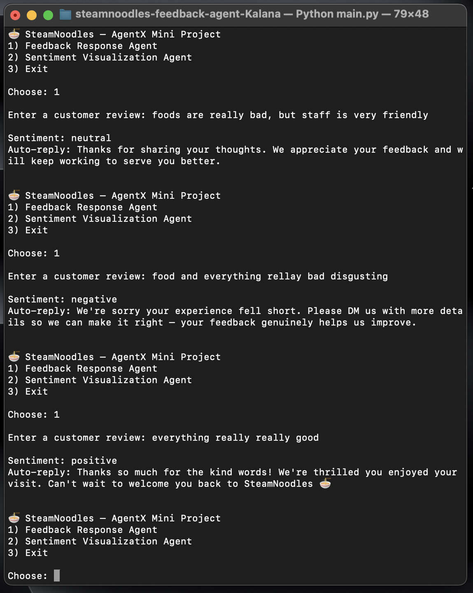
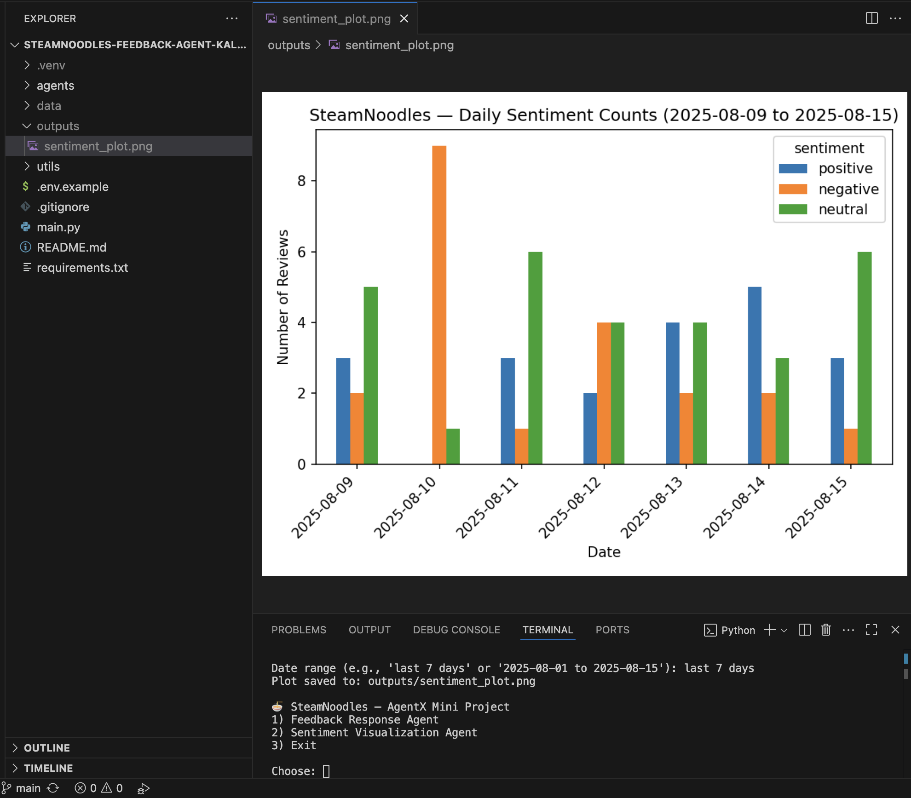

# Automated Restaurant Feedback Agent — SteamNoodles🍜 
(AgentX Mini Project)

**Author:** Kalana Sehas Darshana  
**University:** University of Plymoth UK <br>
**Year:** 3rd Year

## Overview
This project implements a two-agent system using **LangChain** (with optional OpenAI) and **matplotlib**:

- **Agent 1 — Feedback Response Agent**
  - Input: A single customer review (text)
  - Uses an LLM (via LangChain) to classify **positive / negative / neutral** (falls back to rule-based if no API key)
  - Generates a short, polite, context-aware reply

- **Agent 2 — Sentiment Visualization Agent**
  - Input: a date range (e.g., `last 7 days` or `2025-08-01 to 2025-08-15`)
  - Output: a **bar chart** of daily counts for **positive / negative / neutral**
  - Uses your CSV dataset or auto-generates a Kaggle-like sample

## Setup

```bash
# 1) Create venv
python3 -m venv .venv
source .venv/bin/activate
pip install --upgrade pip

# 2) Install deps
pip install -r requirements.txt
```

Optional: enable OpenAI via LangChain (for better sentiment + reply):
```bash
cp .env.example .env
# edit .env and add your OPENAI_API_KEY
```

## Data
- Default CSV path: `data/steamnoodles_reviews.csv` (columns: `date,text[,sentiment]`)
- If the CSV is missing, a sample dataset is created automatically.
- You may replace it with a Kaggle dataset that includes at least `date` and `text` columns.
  - If your dataset has no `sentiment`, the system will classify it on the fly when needed.

## Run

```bash
python main.py
```

Menu:
- `1` Feedback Response Agent — enter one review → sentiment + auto-reply
- `2` Sentiment Visualization Agent — enter a date range → saves plot to `outputs/sentiment_plot.png`

## Examples

**Feedback Response Agent**
<p align="center">
  
</p>

**Visualization (last 7 days)**

<p align="center">
  
</p>


## Repo Structure
```
agents/
  feedback_response_agent.py
  sentiment_visualization_agent.py
utils/
  config.py
  data_loader.py
data/
  (your CSV lives here)
outputs/
  (generated plots)
main.py
requirements.txt
.env.example
.gitignore
README.md
```

## Notes
- Works fully **offline** (rule-based sentiment) and **online** (OpenAI via LangChain) with the exact same CLI.
- Plot uses **matplotlib** and is saved to `outputs/`.
